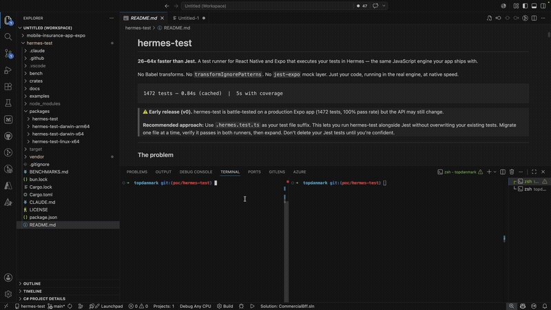

# hermes-test

**26–64x faster than Jest.** A test runner built for React Native and Expo. One esbuild pass, one process, zero Babel — results in under a second.

```
1766 tests, 7 snapshots — 5s  (Jest: 116s → 23x faster)
```

<p align="center">
  
</p>

> Battle-tested as the sole test runner for a production Expo app (284 suites, 1766 tests, 7 snapshots). Zero Jest dependency.

---

### The problem

Jest in React Native is slow by design. Every test file spawns a worker, runs Babel transforms, resolves `transformIgnorePatterns` for every `node_modules` import, and coordinates results over IPC. For a mid-size Expo app, that's 1-2 minutes per run. With coverage, even longer.

On top of that, the configuration tax is real: `transformIgnorePatterns` breaks every time you add a dependency, `jest-expo` mocks silently drift from real APIs, and `moduleNameMapper` requires manual upkeep for every monorepo alias. Developers stop running tests. Tests rot. Coverage drops.

### The fix

hermes-test replaces the entire Jest pipeline with two things: **esbuild** (one bundle pass, <100ms) and a **Rust CLI** that evaluates it in a single process. No workers, no Babel, no `transformIgnorePatterns`. Native modules are auto-detected and externalized — zero manual configuration needed.

By default, tests run in Hermes — the same JavaScript engine your app ships with — so you get engine parity for free. But the real win is speed: results appear before your hand leaves `Cmd+S`.

### Benchmarks

Production Expo app (284 suites, 1766 tests, 7 snapshots):

| | Jest | hermes-test | Speedup |
|---|---|---|---|
| Full suite | 116s | **5s** | **23x** |
| Cached run | 54s | **0.84s** | **64x** |
| With coverage | 128s | **5s** | **26x** |
| Watch rerun | ~3s | **~350ms** | **9x** |

Micro benchmarks (Apple Silicon, no coverage):

| Scenario | hermes-test | Jest + @swc/jest | Speedup |
|----------|-------------|------------------|---------|
| 10 pure function tests | **16ms** | 714ms | **45x** |
| 50 hook tests (renderHook + act) | **75ms** | 721ms | **10x** |
| Trivial cold start | **4.6ms** | 1,486ms | **364x** |

---

## Quick start

```bash
bun add -D hermes-test
```

```ts
// useCounter.test.ts
import { test, expect, renderHook, act } from 'hermes-test';

test('useCounter increments', () => {
  const { result } = renderHook(() => useCounter(0));
  act(() => result.current.increment());
  expect(result.current.count).toBe(1);
});
```

```bash
hermes-test              # run all tests
hermes-test --watch      # watch mode
```

### Engine selection

- **Default:** Hermes (`hermes-test`)
- **Optional:** V8 via `--engine v8` with a matching optional V8 platform package installed
- **V8 status:** Experimental (interop-focused, not the recommended default for performance)
- **Coverage note:** Current V8 coverage runs are significantly slower than Hermes on large suites (observed Topdanmark: V8 ~20–26s vs Hermes ~7–8s)

```bash
hermes-test --engine hermes
hermes-test --engine v8
```

## API

### Test structure

```ts
import { test, describe, expect, beforeEach, afterEach } from 'hermes-test';

describe('myFeature', () => {
  beforeEach(() => { /* reset */ });

  test('does the thing', () => {
    expect(result).toBe(42);
    expect(arr).toEqual([1, 2, 3]);
    expect(str).toContain('hello');
    expect(fn).toThrow('error message');
  });
});
```

### Assertions

```ts
expect(val).toBe(exact)            expect(val).toEqual(deep)
expect(val).toMatchObject(sub)     expect(val).toMatchSnapshot()
expect(val).toBeTruthy()           expect(val).toBeFalsy()
expect(val).toBeDefined()          expect(val).toBeUndefined()
expect(val).toBeNull()             expect(val).toBeGreaterThan(n)
expect(val).toContain(item)        expect(val).toContainEqual(item)
expect(val).toMatch(/regex/)       expect(val).toBeCloseTo(n, precision)
expect(fn).toThrow('msg')          expect(val).not.toBe(other)

// Asymmetric matchers
expect.anything()                  expect.any(String)
expect.objectContaining({ key })   expect.arrayContaining([1, 2])
expect.stringContaining('sub')     expect.stringMatching(/pattern/)

// Async
await expect(promise).resolves.toBe(value)
await expect(promise).rejects.toThrow('msg')
```

### Spies

```ts
import { spy, spyOn, clearAllMocks } from 'hermes-test';

const fn = spy(() => 'default');
fn.mockReturnValue('mocked');
fn.mockReturnValueOnce('first');
fn.mockImplementation((x) => x * 2);
fn.mockResolvedValue('async');

expect(fn).toHaveBeenCalled();
expect(fn).toHaveBeenCalledWith('arg1', 'arg2');
expect(fn).toHaveBeenCalledTimes(3);
expect(fn.calls[0][0]).toBe('arg1');   // direct access

// spyOn — intercept real object methods
const s = spyOn(storage, 'get');
s.mockReturnValue('cached');
s.mockRestore();   // revert to original

// Clear all spies at once
clearAllMocks();
```

### Module mocking

```ts
// ht.mock() — works like jest.mock()
ht.mock('./useRedux', () => ({
  useAppSelector: (selector) => mockState,
}));

// ht.unmock() — opt out of the shim system, bundle the real module
ht.unmock('moment');

// ht.shallow() — auto-mock all JSX child components
ht.shallow('../MyComponent');
```

Shadow wrappers check mocks at call time — `ht.mock` can appear before or after imports.

### Hook testing

```ts
import { renderHook, act, waitFor } from 'hermes-test';

const { result, history, renderCount } = renderHook(() => useCounter(0));
act(() => result.current.increment());
expect(result.current.count).toBe(1);
expect(renderCount).toBe(2);
```

### Component rendering

```ts
import { render, fireEvent, expect } from 'hermes-test';

const { getByText, getByTestId, toJSON } = render(<MyComponent />);

// Queries (all have get/getAll/query/queryAll variants)
getByText('Hello');                  getByText(/hello/i);
getByTestId('submit-btn');           getByProps({ disabled: true });
getByType('View');

// Fire events
fireEvent.press(getByTestId('btn'));
fireEvent.changeText(getByTestId('input'), 'new value');
fireEvent.scroll(getByTestId('list'), { nativeEvent: { contentOffset: { y: 100 } } });
fireEvent(node, 'focus');            // generic

// Serialization
toJSON();                            // plain object tree
toTree();                            // pretty-printed JSX string

// Lifecycle
rerender(<MyComponent updated />);
unmount();
```

### Element matchers

```ts
expect(element).toBeRendered();
expect(element).toHaveTextContent('Hello');
expect(element).toHaveTextContent(/hello/i);
expect(element).toContainElement(child);
expect(element).toBeEmpty();
expect(input).toHaveDisplayValue('current value');
expect(element).toHaveProp('testID', 'my-id');
expect(element).toHaveStyle({ backgroundColor: 'red' });
expect(button).toBeEnabled();       expect(button).toBeDisabled();
expect(element).toBeVisible();      // checks display + opacity
```

### Snapshot testing

```ts
// First run: creates __snapshots__/myComponent.test.tsx.snap
expect(toJSON()).toMatchSnapshot();

// Subsequent runs: compares against stored snapshot, fails on mismatch
// Update snapshots:
// hermes-test --update-snapshots
```

### Fetch mocking (MSW-style)

```ts
import { http, HttpResponse } from 'hermes-test';

// Register handlers — auto-overwrites matching method+url
ht.mock.fetch(
  http.get('https://api.example.com/data', () => HttpResponse.json({ ok: true })),
  http.post('https://api.example.com/login', () => HttpResponse.json({ token: '...' })),
);

// Override in a specific test — same API, auto-replaces
ht.mock.fetch(http.get('https://api.example.com/data', () => HttpResponse.error()));

// Reset all handlers
ht.mock.fetch.reset();
```

### Redux store

```ts
import { setupApiStore } from 'hermes-test/store';

const ctx = setupApiStore([api, cms], { app: rootReducer }, {
  preloadedState: { app: { auth: { session: mockSession } } },
});
const { result } = ctx.renderHookWithReduxStore(() => useMyHook());
ctx.store.dispatch(authActions.logout());
```

### Fake timers

```ts
import { useFakeTimers, advanceTimersByTime, useRealTimers } from 'hermes-test';

useFakeTimers();
setTimeout(() => { fired = true }, 1000);
advanceTimersByTime(1000);
expect(fired).toBe(true);
useRealTimers();
```

## Platform requirements

| Platform | Status | Notes |
|----------|--------|-------|
| **macOS (Apple Silicon / Intel)** | ✅ Fully supported | Recommended for CI/CD |
| **Linux** | ⚠️ Partial | Intl/locale formatting incomplete — see below |

hermes-test runs on the **Hermes JavaScript engine**, the same engine that powers React Native on iOS and Android. Hermes's Intl (internationalization) support varies by platform:

- **macOS**: Full Intl support via Apple's Foundation framework (`toLocaleDateString`, `toLocaleString` etc. work correctly with any locale)
- **Android** (device): Full Intl support via Java ICU
- **Linux** (desktop/CI): Hermes's Linux Intl implementation (`PlatformIntlICU.cpp`) is incomplete — `Intl.NumberFormat` is a stub that ignores the locale parameter. `Intl.DateTimeFormat` works via ICU but `NumberFormat` produces raw C-style output (e.g. `"1234.560000"` instead of `"1.234,56"`)

**For CI/CD, use a macOS runner** to ensure locale-dependent tests produce correct results. Linux runner support is planned for a future release.

<details>
<summary>Why is Linux Intl incomplete?</summary>

Hermes has three platform-specific Intl backends ([source](https://github.com/facebook/hermes/blob/main/lib/Platform/Intl/CMakeLists.txt)):

- **Apple** → `PlatformIntlApple.mm` — delegates to Foundation's `NSDateFormatter`/`NSNumberFormatter` (full CLDR locale data)
- **Android** → `PlatformIntlAndroid.cpp` — delegates to Java's `android.icu` via JNI
- **Linux/other** → `PlatformIntlICU.cpp` — intended to use ICU4C directly, but `NumberFormat` was never implemented. The [source code](https://github.com/facebook/hermes/blob/fd0e1d3ed/lib/Platform/Intl/PlatformIntlICU.cpp) contains a stub with the comment: *"This isn't right, but I didn't want to do more work for a stub."*

The Hermes team has acknowledged this is a work-in-progress ([discussion #1211](https://github.com/facebook/hermes/discussions/1211), [issue #23](https://github.com/facebook/hermes/issues/23)). Since Hermes is optimized for mobile (iOS/Android), desktop Linux has been lower priority.

See also: [Hermes IntlAPIs documentation](https://github.com/facebook/hermes/blob/main/doc/IntlAPIs.md)
</details>

---

## How it works

```
┌──────────────┐     ┌─────────┐     ┌────────────┐
│  .test.ts    │────▶│ esbuild │────▶│   Hermes   │
│  files       │     │ bundle  │     │   VM eval  │
└──────────────┘     └─────────┘     └────────────┘
       │                  │                 │
  mockModule()      <100ms bundle     native execution
  spy/expect        path aliases      drainMicrotasks
  renderHook        mock hoisting      real React tree
```

1. **esbuild** bundles your test + source into a single IIFE (~100ms)
2. Rust CLI applies **mock hoisting** and injects the require shim for native modules
3. **Bytecode compilation** — cached .hbc for instant loading on subsequent runs
4. **Hermes VM** evaluates the bytecode — same engine as your app
5. Results printed to terminal — single process, no workers, no IPC

### Three-tier cache

| Tier | What | Speed |
|---|---|---|
| **Bytecode (.hbc)** | Pre-compiled Hermes bytecode | Fastest — skip JS parsing |
| **Patched JS** | Post-patched esbuild output | Fast — skip bundling + patching |
| **Fresh bundle** | Full esbuild + patch pipeline | Cold start only |

### Auto-detect native externals

Native modules are detected automatically by scanning `node_modules` for `ios/`, `android/`, `*.podspec`, and `app.plugin.js`. No manual `externals` config needed for standard React Native packages.

### Mock isolation (Shadow Wrappers)

When multiple test files mock the same module differently, hermes-test uses **shadow wrappers** — filesystem-based Proxy wrappers that check which test file is running at call time. One bundle, one runtime, per-file mock isolation.

## CLI

```bash
hermes-test                          # run all test files
hermes-test src/hooks/               # run tests in a directory
hermes-test src/hooks/useLogin.test.ts  # run a specific file
hermes-test --watch                  # watch mode — reruns on file changes
hermes-test --watch useLogin         # watch mode, filtered to matching files
hermes-test --coverage               # run with coverage (lcov + HTML report)
hermes-test --engine hermes          # explicit Hermes (default)
hermes-test --engine v8              # V8 (requires @hermes-test-v8/<platform>)
```

## Configuration

### Polyrepo (single package)

No config file needed for simple projects. Just run `hermes-test` in your project root.

```
my-app/
├── src/
│   └── hooks/
│       └── useLogin.hermes.test.ts
├── package.json
└── tsconfig.json          ← path aliases read automatically
```

### Monorepo

Create `hermes-test.config.json` in your app directory. The `root` field tells hermes-test where the monorepo root is (for resolving shared `node_modules`).

```
monorepo/
├── apps/
│   └── my-app/
│       ├── src/
│       ├── hermes-test.config.json   ← config here
│       ├── package.json
│       └── tsconfig.json
├── packages/
│   └── shared/
└── node_modules/                     ← root points here
```

```json
{
  "root": "../..",
  "testMatch": ".hermes.test.ts"
}
```

### hermes-test.config.json

| Key | Description | Required |
|-----|-------------|----------|
| `root` | Monorepo workspace root (for resolving node_modules) | Monorepo only |
| `testMatch` | Test file suffix (default: `.test.ts`) | No |
| `externals` | Additional modules to externalize | No (most auto-detected) |
| `shims` | Built-in or custom module replacements | No |
| `coverageThreshold` | Minimum coverage % — fails if below (e.g. `65`) | No |

**tsconfig paths** are read automatically — monorepo path aliases just work:

```json
{
  "compilerOptions": {
    "paths": {
      "@app/*": ["./src/*"],
      "@myorg/shared/*": ["../../packages/shared/src/*"]
    }
  }
}
```

**Native externals** are auto-detected by scanning `node_modules` for `ios/`, `android/`, `*.podspec`, and `app.plugin.js`. Most projects need zero manual `externals`.

### Built-in shims

hermes-test ships with ready-to-use shims for common React Native ecosystem packages. Use `hermes-test/shims/<name>` in your config — no local shim files needed.

| Shim | What it provides |
|------|-----------------|
| `hermes-test/shims/react-native` | Platform, StyleSheet, Dimensions, Alert, Linking stubs |
| `hermes-test/shims/react-i18next` | Identity translation (`t('key')` returns `'key'`) |
| `hermes-test/shims/async-storage` | In-memory AsyncStorage (getItem, setItem, clear, etc.) |
| `hermes-test/shims/rtk-query` | RTK Query createApi singleton cache |
| `hermes-test/shims/react-redux` | Pass-through for react-redux |
| `hermes-test/shims/reduxjs-toolkit` | Pass-through for @reduxjs/toolkit |

Example config with shims:

```json
{
  "root": "../..",
  "testMatch": ".hermes.test.ts",
  "shims": {
    "react-i18next": "hermes-test/shims/react-i18next",
    "@reduxjs/toolkit/query/react": "hermes-test/shims/rtk-query",
    "@react-native-async-storage/async-storage": "hermes-test/shims/async-storage"
  }
}
```

You can also write custom shims for app-specific native modules:

```json
{
  "shims": {
    "react-native-keychain": "./test/shims/keychain.js"
  }
}
```

## Coverage

```bash
hermes-test --coverage
```

Generates:
- **Terminal table** — per-file line + function coverage with color coding
- **`coverage/lcov.info`** — standard lcov format, works with any lcov tool
- **`coverage/index.html`** — interactive HTML report with source-level green/red highlighting

Coverage uses esbuild source maps for accurate original-file line mapping. Imports, `node_modules`, test files, and monorepo dependencies are automatically excluded — only your source code is measured.

### Coverage threshold

Add `coverageThreshold` to `hermes-test.config.json` to fail CI when coverage drops:

```json
{
  "coverageThreshold": 65
}
```

If total statement coverage is below the threshold, hermes-test exits with code 1.

## Stack

- **Hermes** — the JS engine that ships with React Native and Expo
- **esbuild** — bundler, 100x faster than Babel/Metro transforms
- **Rust** — CLI host, native Hermes FFI, bytecode caching
- **TypeScript** — test harness (spy, expect, renderHook, mockFetch, timers)

## Why not Jest?

| | Jest + jest-expo | hermes-test |
|---|-----------------|-------------|
| Bundling | Babel on every import | esbuild, one pass |
| Startup | ~700ms per worker | ~5ms total |
| Native externals | Manual `transformIgnorePatterns` | Auto-detected |
| Config needed | `transformIgnorePatterns`, `moduleNameMapper`, mocks | Zero for most projects |
| Watch rerun | ~2-3s | ~300ms |
| 1472 tests (no coverage) | 54s | **0.84s** |
| 1472 tests (with coverage) | 128s | **5s** |
| Coverage | Built-in (v8/Istanbul) | `--coverage` with source maps, HTML report, threshold |
| Engine | Node | Hermes (same as your app) |

## Platform support

| Platform | Status |
|----------|--------|
| macOS (Apple Silicon) | Supported |
| Linux (x64) | Supported |
| macOS (Intel x64) | Planned |
| Windows | Not planned |

## Roadmap

- [x] **Coverage reporting** — source map-based instrumentation, lcov + HTML report, threshold enforcement
- [ ] **macOS Intel (x64)** — cross-compile or dedicated CI runner
- [x] **Component rendering** — `render(<Component />)` with query API (`getByText`, `getByTestId`, `fireEvent`)
- [ ] **Jest compatibility shim** — `jest.fn()` → `spy()`, `jest.mock()` → `mockModule()`, enables reuse of library `__mocks__/` files
- [ ] **Library mock support** — auto-load mocks from expo-router, react-native-reanimated, zustand, etc.
- [ ] **`setupFiles` config** — load setup files before tests (like Jest's `setupFilesAfterFramework`)

## License

MIT
