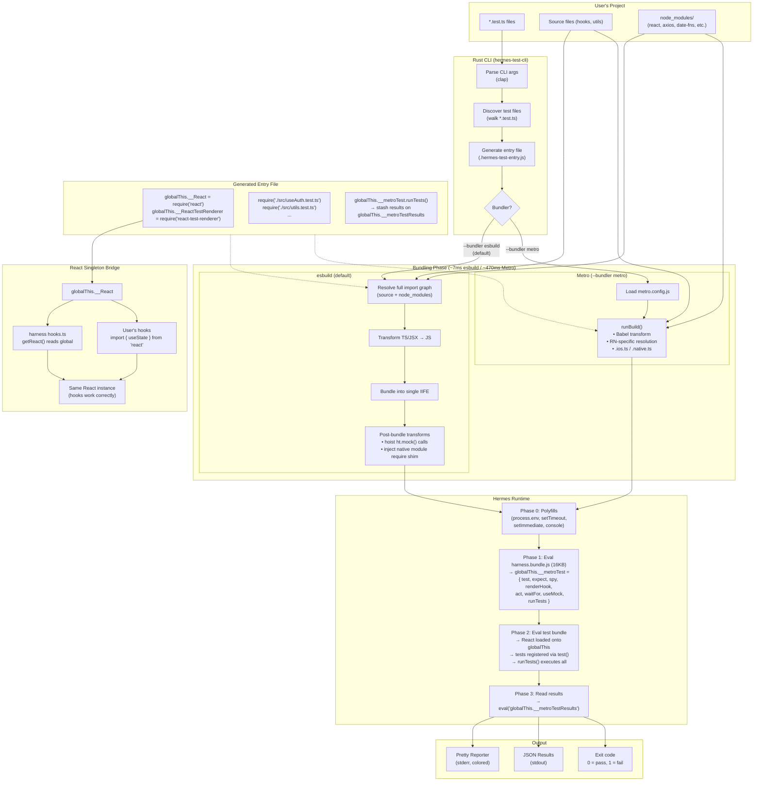
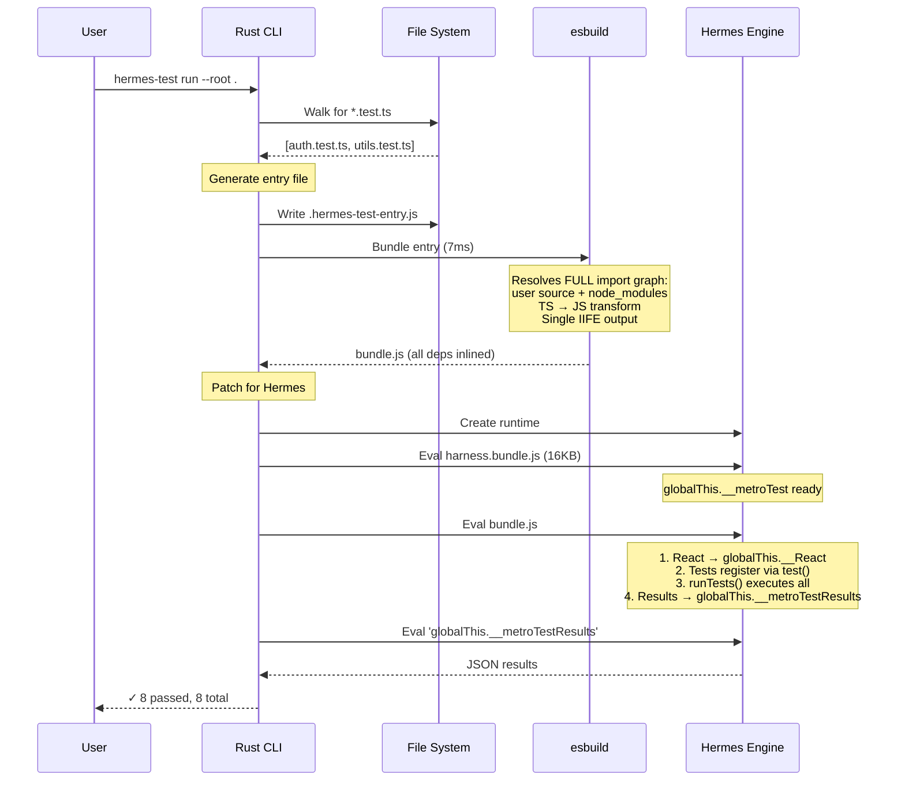
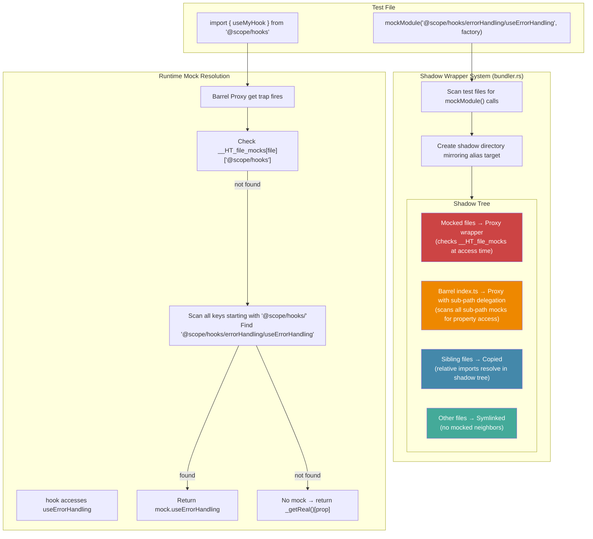
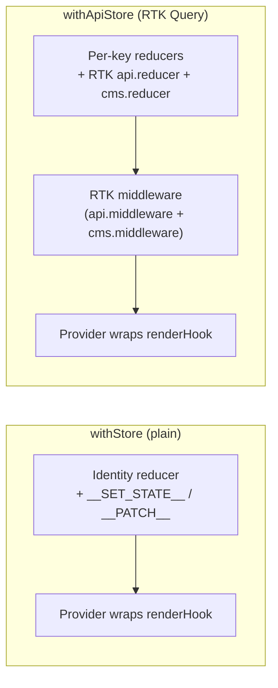
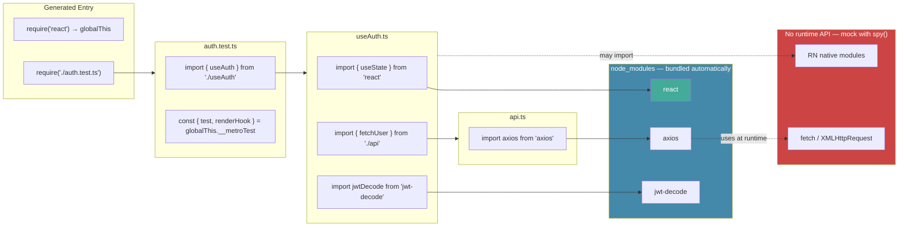

# hermes-test — Full Application Architecture

## Execution Flow

## Mock System — Shadow Wrappers & Barrel Delegation

### Key Design Decisions

1. **Shadow wrappers over AST transforms** — No source modification, works with any bundler output
2. **Barrel sub-path delegation** — Barrel Proxy checks ALL registered sub-path mocks, not just exact path match. Solves esbuild's barrel re-export inlining.
3. **Copy barrel files, symlink the rest** — esbuild resolves symlinks to real paths. Copied barrels keep relative imports within the shadow tree. Only barrels + files with mocked siblings are copied.
4. **Lazy loading via `_getReal()`** — Real module only loaded on first property access, avoiding circular dependency crashes.

### withStore / withApiStore (Redux Provider)

### Polyfills (polyfills.js)

Hermes lacks several Web/Node APIs. Polyfills injected via esbuild banner:
- `process.env.NODE_ENV` — React needs this at load time
- `process.nextTick` — Node-style async patterns
- `crypto.getRandomValues` — uuid and crypto-dependent libs
- `MessageChannel` — React 19 scheduler
- `setTimeout/setImmediate` — Timer polyfills
- `AbortController/Headers/URL/URLSearchParams/Request/Response/fetch` — Web APIs for RTK Query

## Dependency Resolution

