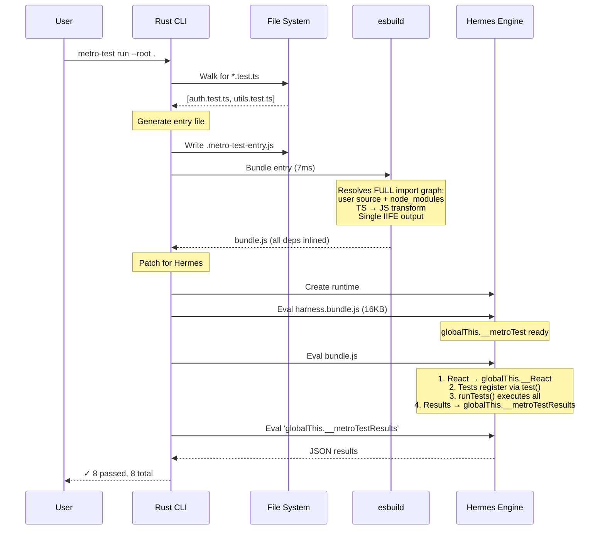
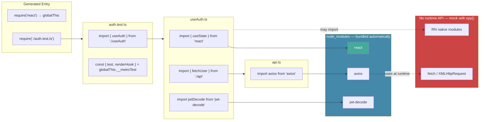

# metro-test — Full Application Architecture

```mermaid
flowchart TB
    subgraph USER["User's Project"]
        TEST["*.test.ts files"]
        SRC["Source files (hooks, utils)"]
        NM["node_modules/\n(react, axios, date-fns, etc.)"]
    end

    subgraph CLI["Rust CLI (metro-test-cli)"]
        PARSE["Parse CLI args\n(clap)"]
        DISCOVER["Discover test files\n(walk *.test.ts)"]
        ENTRY["Generate entry file\n(.metro-test-entry.js)"]
        CHOOSE{Bundler?}
    end

    subgraph BUNDLE["Bundling Phase (~7ms esbuild / ~470ms Metro)"]
        subgraph ESBUILD["esbuild (default)"]
            EB_RESOLVE["Resolve full import graph\n(source + node_modules)"]
            EB_TRANSFORM["Transform TS/JSX → JS"]
            EB_BUNDLE["Bundle into single IIFE"]
            EB_PATCH["Patch for Hermes\n• fix for-let-of closure bug\n• add configurable:true\n• downlevel async/await"]
        end
        subgraph METRO["Metro (--bundler metro)"]
            M_CONFIG["Load metro.config.js"]
            M_BUILD["runBuild()\n• Babel transform\n• RN-specific resolution\n• .ios.ts / .native.ts"]
        end
    end

    subgraph ENTRY_FILE["Generated Entry File"]
        direction TB
        BOOTSTRAP["globalThis.__React = require('react')\nglobalThis.__ReactTestRenderer = require('react-test-renderer')"]
        IMPORTS["require('./src/useAuth.test.ts')\nrequire('./src/utils.test.ts')\n..."]
        RUN["globalThis.__metroTest.runTests()\n→ stash results on globalThis.__metroTestResults"]
    end

    subgraph HERMES["Hermes Runtime"]
        direction TB
        POLYFILLS["Phase 0: Polyfills\n(process.env, setTimeout,\nsetImmediate, console)"]
        HARNESS["Phase 1: Eval harness.bundle.js (16KB)\n→ globalThis.__metroTest =\n{ test, expect, spy, renderHook,\n  act, waitFor, useMock, runTests }"]
        EVAL_BUNDLE["Phase 2: Eval test bundle\n→ React loaded onto globalThis\n→ tests registered via test()\n→ runTests() executes all"]
        RESULTS["Phase 3: Read results\n→ eval('globalThis.__metroTestResults')"]
    end

    subgraph REACT_BRIDGE["React Singleton Bridge"]
        direction LR
        GLOBAL_R["globalThis.__React"]
        HARNESS_READ["harness hooks.ts\ngetReact() reads global"]
        USER_CODE["User's hooks\nimport { useState } from 'react'"]
        SAME["Same React instance\n(hooks work correctly)"]
    end

    subgraph OUTPUT["Output"]
        PRETTY["Pretty Reporter\n(stderr, colored)"]
        JSON_OUT["JSON Results\n(stdout)"]
        EXIT["Exit code\n0 = pass, 1 = fail"]
    end

    TEST --> PARSE
    PARSE --> DISCOVER
    DISCOVER --> ENTRY
    ENTRY --> CHOOSE

    CHOOSE -->|"--bundler esbuild\n(default)"| EB_RESOLVE
    CHOOSE -->|"--bundler metro"| M_CONFIG

    EB_RESOLVE --> EB_TRANSFORM
    SRC --> EB_RESOLVE
    NM --> EB_RESOLVE
    EB_TRANSFORM --> EB_BUNDLE
    EB_BUNDLE --> EB_PATCH

    M_CONFIG --> M_BUILD
    SRC --> M_BUILD
    NM --> M_BUILD

    ENTRY_FILE -.-> EB_RESOLVE
    ENTRY_FILE -.-> M_BUILD

    EB_PATCH --> POLYFILLS
    M_BUILD --> POLYFILLS

    POLYFILLS --> HARNESS
    HARNESS --> EVAL_BUNDLE
    EVAL_BUNDLE --> RESULTS

    BOOTSTRAP --> GLOBAL_R
    GLOBAL_R --> HARNESS_READ
    GLOBAL_R --> USER_CODE
    HARNESS_READ --> SAME
    USER_CODE --> SAME

    RESULTS --> PRETTY
    RESULTS --> JSON_OUT
    RESULTS --> EXIT
```

## Execution Flow

```mermaid
sequenceDiagram
    participant User as User
    participant CLI as Rust CLI
    participant FS as File System
    participant ESB as esbuild
    participant Hermes as Hermes Engine

    User->>CLI: metro-test run --root .
    CLI->>FS: Walk for *.test.ts
    FS-->>CLI: [auth.test.ts, utils.test.ts]

    Note over CLI: Generate entry file

    CLI->>FS: Write .metro-test-entry.js
    CLI->>ESB: Bundle entry (7ms)

    Note over ESB: Resolves FULL import graph:<br/>user source + node_modules<br/>TS → JS transform<br/>Single IIFE output

    ESB-->>CLI: bundle.js (all deps inlined)

    Note over CLI: Patch for Hermes

    CLI->>Hermes: Create runtime
    CLI->>Hermes: Eval harness.bundle.js (16KB)

    Note over Hermes: globalThis.__metroTest ready

    CLI->>Hermes: Eval bundle.js

    Note over Hermes: 1. React → globalThis.__React<br/>2. Tests register via test()<br/>3. runTests() executes all<br/>4. Results → globalThis.__metroTestResults

    CLI->>Hermes: Eval 'globalThis.__metroTestResults'
    Hermes-->>CLI: JSON results

    CLI-->>User: ✓ 8 passed, 8 total
```

## Dependency Resolution

```mermaid
flowchart LR
    subgraph ENTRY["Generated Entry"]
        E1["require('react') → globalThis"]
        E2["require('./auth.test.ts')"]
    end

    subgraph TEST1["auth.test.ts"]
        T1_HOOK["import { useAuth } from './useAuth'"]
        T1_MT["const { test, renderHook } = globalThis.__metroTest"]
    end

    subgraph HOOK["useAuth.ts"]
        H1["import { useState } from 'react'"]
        H2["import { fetchUser } from './api'"]
        H3["import jwtDecode from 'jwt-decode'"]
    end

    subgraph API["api.ts"]
        A1["import axios from 'axios'"]
    end

    subgraph NM["node_modules — bundled automatically"]
        REACT["react"]
        JWT["jwt-decode"]
        AXIOS["axios"]
    end

    subgraph MOCK["No runtime API — mock with spy()"]
        FETCH["fetch / XMLHttpRequest"]
        NATIVE["RN native modules"]
    end

    E2 --> TEST1
    T1_HOOK --> HOOK
    H1 --> REACT
    H2 --> API
    H3 --> JWT
    A1 --> AXIOS

    AXIOS -. "uses at runtime" .-> FETCH
    HOOK -. "may import" .-> NATIVE

    style REACT fill:#4a9,color:#fff
    style MOCK fill:#c44,color:#fff
    style NM fill:#48a,color:#fff
```
